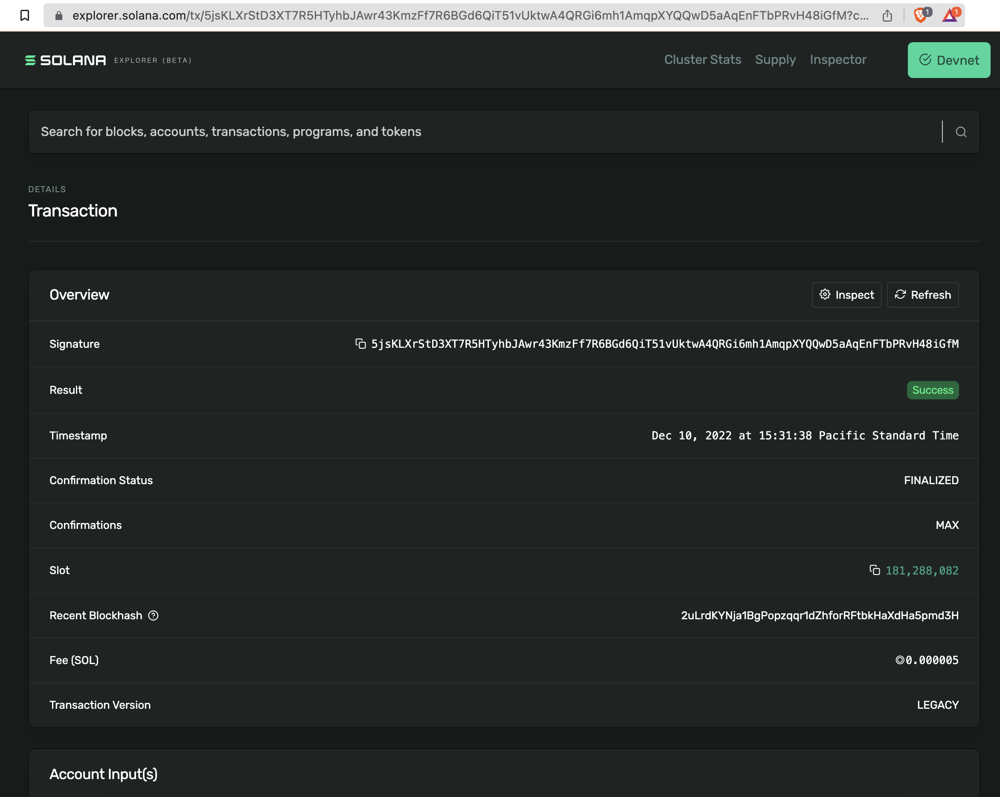
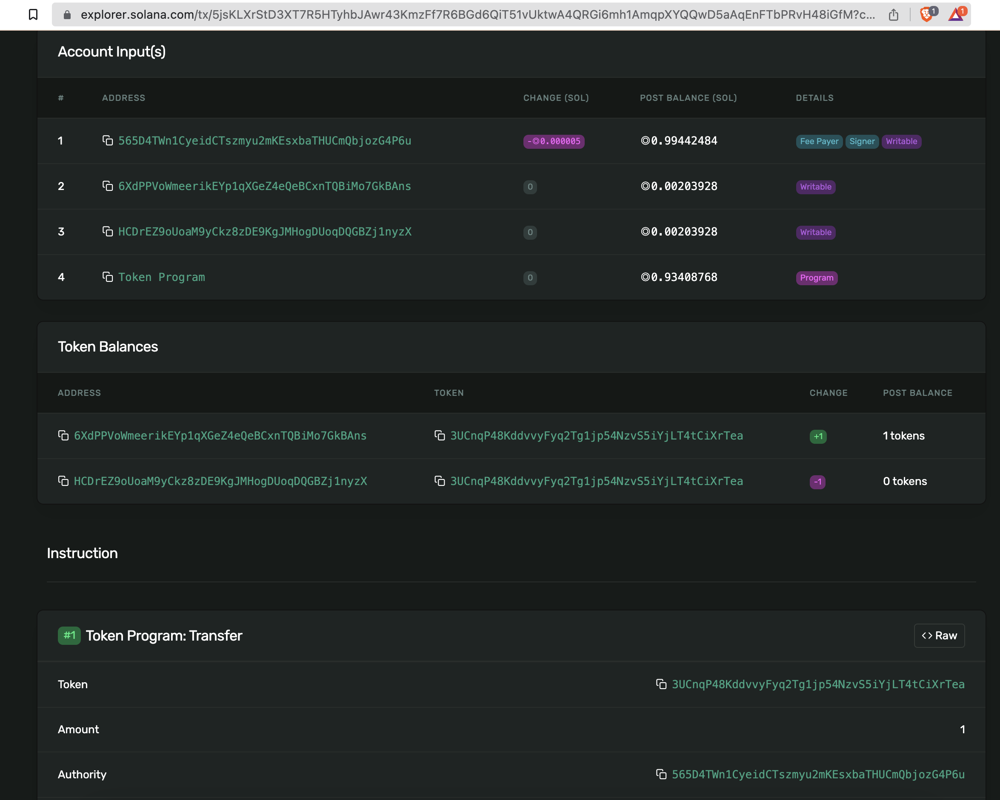

# SolanaNFT

Basic script to mint a Solana NFT

Based on the instructions at [How to Mint an NFT on Solana](https://www.quicknode.com/guides/solana-development/how-to-mint-an-nft-on-solana)

Output of `./run.sh`
```
fromWallet public key 565D4TWn1CyeidCTszmyu2mKEsxbaTHUCmQbjozG4P6u
Requesting airdrop
Confirming signature for airdrop
Creating mint
Mint (Token) 3UCnqP48KddvvyFyq2Tg1jp54NzvS5iYjLT4tCiXrTea
Creating fromTokenAccount
fromTokenAccount address HCDrEZ9oUoaM9yCkz8zDE9KgJMHogDUoqDQGBZj1nyzX
Creating toTokenAccount
toWallet public key H8kfYA8mCKU7EaxchjKVN3bN3wfjqs8wewKEPrfP6uvX
toTokenAccount address 6XdPPVoWmeerikEYp1qXGeZ4eQeBCxnTQBiMo7GkBAns
Minting token
Setting the minting authority
Transferring the token
SIGNATURE 5jsKLXrStD3XT7R5HTyhbJAwr43KmzFf7R6BGd6QiT51vUktwA4QRGi6mh1AmqpXYQQwD5aAqEnFTbPRvH48iGfM
```

Now look up the signature in the Solana block explorer (Devnet)

https://explorer.solana.com/tx/5jsKLXrStD3XT7R5HTyhbJAwr43KmzFf7R6BGd6QiT51vUktwA4QRGi6mh1AmqpXYQQwD5aAqEnFTbPRvH48iGfM?cluster=devnet





